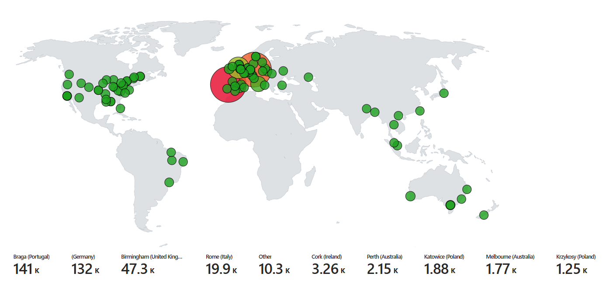

# Cybersecurity Lab: Azure Sentinel and Honeypot Setup


## Overview


In this cybersecurity lab, I set up a cloud-based Security Information and Event Management (SIEM) system using Azure Sentinel and a Virtual Machine Honeypot. I observed live cyberattacks, including Remote Desktop Protocol (RDP) brute-force attempts, originating from various locations worldwide.

To enhance the analysis, I utilized a custom PowerShell script to retrieve the geolocation data of the attackers and plotted their locations on the Azure Sentinel Map.

This project was inspired by the invaluable guidance provided in the YouTube video <a href="https://youtu.be/RoZeVbbZ0o0?list=PL85GlCRx5t-Lo3Z5aoSFwozqEkuQtuRmk" target="_new">"SIEM Tutorial for Beginners | Azure Sentinel Tutorial MAP with LIVE CYBER ATTACKS!</a>" by Josh Madakor. The video's step-by-step instructions, practical demonstrations, and clear explanations played a crucial role in setting up Azure Sentinel and deploying the Virtual Machine Honeypot.




# Delete Stuff Below This Line


## Initial Setup and Configuration

1. **Azure Subscription Setup:**
   - Created an Azure subscription.
   - Provisioned a virtual machine in Azure, intentionally making it highly vulnerable by turning off external and Windows firewalls.

2. **Log Management:**
   - Established a log repository in Azure using Log Analytics Workspace to ingest logs from the vulnerable virtual machine.

3. **Azure Sentinel Configuration:**
   - Configured Azure Sentinel to create a map visualizing attacker data.

## Extracting and Mapping Log Data

1. **PowerShell Script:**
   - Utilized PowerShell to extract IP addresses from Windows logs on the virtual machine.

2. **Geolocation Mapping:**
   - Sent extracted IP addresses to a third-party API to derive latitude and longitude data.
   - Created a custom log with geographic information to visualize attacks on a world map.

## Continuous Monitoring and Analysis

1. **Lab Monitoring:**
   - Continuously monitored and analyzed attacker data.

2. **Insights Gained:**
   - Observed distribution and frequency of attacks, gaining insights into the nature of cyber threats.

## Conclusion

The cybersecurity lab successfully demonstrated the practical application of tools such as Azure Sentinel and honeypots. The experience deepened my understanding of cybersecurity and emphasized the importance of proactive defense measures.

## Future Updates

Stay tuned for more cybersecurity content and practical demonstrations. Future updates will include additional experiments and labs, providing valuable insights into the evolving field of cybersecurity.

Feel free to explore the repository and use the provided resources for your own learning and experimentation. Contributions and feedback are welcome!


<h1>Azure Sentinel (SIEM) Honeypot Home Lab</h1>


<h2>Description</h2>
Welcome to the Azure Sentinel Honeypot Homelab walkthrough! In this guide, we will explore how to set up and utilize a powerful and educational Homelab using Microsoft Azure Sentinel. Honeypots are decoy systems designed to attract and monitor malicious activity, providing valuable insights into potential threats and attackers' tactics. A SIEM (Security Information and Event Management) is a comprehensive security solution that helps organizations collect, analyze, and respond to security events in real-time. With Azure Sentinel, Microsoft's cloud-native SIEM (Security Information and Event Management) solution, we can gain a comprehensive view of security events and automate threat detection and response. Unleash the power of our homelab where cybersecurity meets innovation! Track and log attacks from around the globe and witness our mesmerizing attack map take shape. Discover the thrilling world of cyber warfare with us!
<br/>

<h2>Learning Objectives </h2>

- Setting up and rolling out various Azure components including Virtual Machines (VMs), Log Analytics Workspaces, and Azure Sentinel 
- Competence and experience with Microsoft Azure Sentinel, a SIEM (Security Information and Event Management) Log Management Tool
- Third-party API Calls
- Using KQL to query logs
- Learn how to read the Security Event Logs in Windows
- Utilize Workbooks (World Map) to make an interactive map showing attack statistics


<h2>Technologies + Requirements </h2>

- Microsoft Azure + Account 
- Azure Services: Sentinel, Log Analytics Workspace, Workbooks, Network Security Groups
- Powershell
- Remote Desktop Protocol (RDP)
- Third-party API: <a href="https://ipgeolocation.io/"> ipgeolocation.io </a>
- Customized <a href="https://github.com/joshmadakor1/Sentinel-Lab/blob/main/Custom_Security_Log_Exporter.ps1"> Powershell Script </a> authored by Josh Madakor

<h2>Overview:</h2>


<h2>Step 1: Create a Microsoft Azure Account: <a href="https://azure.microsoft.com/en-us/free/"> Azure </a></h2>

> Microsoft offers $200 in Azure credit for 30 days when you initially sign up


<h2>Step 2: Setup our honey pot virtual machine</h2>

> Vulnerable Windows VM


<h3>Basics</h3>

- After signing up, click "Go to the Azure Portal" , or visit `portal.azure.com`
- In the search bar type "`virtual machines`"
- Under Create tab click on Azure virtual machine

<h4>Project Details</h4>

- Create a new resource group and give it a name (honeypot-lab)

> A resource group is a container that helps organize and manage related cloud resources.

<h4>Instance Details</h4>

- Give your virtual machine a name (honeypot-vm)
- Choose a recommended region: ((US) West 3)
- Availability options: No infrastructure redundancy required
- Security type: Standard
- Image: Windows 10 Pro, version 22H2 - x64 Gen2
- VM Architecture: x64
- Size: Default is fine (Standard_D2s_v3 – 2vcpus, 8 GiB memory)

<h4>Administrator account</h4>

- Set up a username and password for the virtual machine.

> IMPORTANT: these identification details will be used to log into the virtual machine. (Make sure to keep them in mind) 

<h4>Inbount port rules</h4>

- Public inbound ports -> Allow selected ports: RDP (3389)

<h4>Licensing</h4>

- Confirm Licensing
- Select <b>Next : Disks ></b>


<h3>Disks</h3>

- Leave everything as is
- Select <b>Next : Networking > </b>

<h3>Networking</h3>

<b>Network interface</b>
- NIC network security group: Advanced -> Create new

> A Network Security Group (NSG) in Azure is a virtual firewall that filters and controls network traffic to protect Azure resources.

- By clicking the three dots, delete Inbound rules (1000: default-allow-rdp)
- Add an inbound rule
- Destination port ranges: * (wildcard for anything)
- Protocol: Any
- Action: Allow
- Priority: 100 (low)
- Name: Anything (allow-any-inbound)
- Select <b>Review + Create</b>


> The VM will be simple to detect if the firewall is set up to accept traffic from anywhere.

<h2>Step 3 : Provisioning a Log Analytics Workspace</h2>

- Search for "Log analytics workspaces"
- Select <b>Create Log Analytics workspace</b>
- Place it in the identical resource group as the VM (honeypot-lab) 
- Give it the name you choose (honeypot-law) 
- Add to the same region (West US 3)
- Select <b>Review + Create</b>


> Custom logs with geographic information to map the locations of attackers will be absorbed into Log Analytics workspaces together with the Windows Event Viewer logs.

<h2>Step 4 : Setup Microsoft Defender for Cloud</h2>

- Search for "Microsoft Defender for Cloud"
- Under <b>Management</b> click on "Environment settings" -> Subscription Name -> Log Analytics Workspace Name (honeypot-law)


<b>Settings | Defender plans</b>

- Foundational CSPM (Cloud Security Posture Management): ON
- Servers: ON
- SQL servers on machines: OFF
- Click <b>Save</b>


<b>Settings | Data collection</b>

- Select "All Events"
- Click <b>Save</b>

<h2>Step 5 : Link Virtual Machine to the Log Analytics Workspace</h2>

- Look for "Log Analytics workspaces"
- Select workspace name (honeypot-law) -> "Virtual machines" -> virtual machine name (honeypot-vm)
- Hit <b>Connect</b>


<h2>Step 6 : Setup Microsoft Sentinel</h2>

- Look for "Microsoft Sentinel"
- Hit <b>Create Microsoft Sentinel</b>
- Choose Log Analytics Workspace name (honeypot-law)
- Hit <b>Add</b>


<h2>Step 7 : Turn OFF the Virtual Machine's firewall</h2>

> Testing Firewall - first we can test the firewall by pinging the VM's IP address. The purpose of this is to check if the target device with that specific IP address is reachable and responsive on the network. <b>"PING"</b> is a basic network troubleshooting tool used to test connectivity between your device and the target device.

<h4>For Windows:</h4>
<ol>
<li>Open the Command Prompt: Press the Windows key, type "cmd," and press Enter to open the Command Prompt</li>
<li>Type the Ping Command: In the Command Prompt window, type the following command and press Enter:</li>
</ol>
   
```ping (ip-adress)```

3. Replace <IP-address> with the actual IP address you want to ping. For example:

```ping 20.163.108.170```

<h4>For macOS and Linux</h4>
<ol>
<li>Open the Terminal: On macOS, you can find the Terminal in Applications > Utilities. On Linux, press Ctrl + Alt + T to open the Terminal.</li>
<li>Type the Ping Command: In the Terminal window, type the following command and press Enter:</li>
</ol>
   
```ping (ip-adress)```

3. Replace <IP-address> with the actual IP address you want to ping. For example:

```ping 20.163.108.170```

<h4>Both :</h4>

- Observe the Results: the ping command will start sending packets to the specified IP address, and you'll see the results with round-trip times and other statistics. To stop the ping process on both Windows and macOS/Linux, you can press Ctrl + C or Ctrl + Z
  


> As you can see above our firewall is set up to block out incoming ping requests. Next we will continue to disable the firewall...

- Locate the honeypot VM (honeypot-vm) under Virtual Machines.
- Copy the IP address from the VM 
- Using the credentials from step 2, access the virtual machine through Remote Desktop Protocol (RDP). <b>Note</b>: if your on a Mac you can download the "Microsoft Remote Desktop" application or use another VM host for Microsoft that supports the protocol.
- Accept Certificate warning
- Select NO for all <b>Choose privacy settings for your device</b>
- Hit Start and search for "wf.msc" (Windows Defender Firewall)
- Click "Windows Defender Firewall Properties"
- Turn Firewall State OFF for <b>Domain Profile | Private Profile | and Public Profile</b>
- Click Apply and Ok
- To check if VM is reachable, ping it using the command line of the host ```ping -t (ip-adress)```


>Ping successful :)

<h2>Step 8 : Automating the Security Log Exporter</h2>

- In your VM launch Powershell ISE
- Configure Edge browser without logging in
- Copy <a href="https://github.com/joshmadakor1/Sentinel-Lab/blob/main/Custom_Security_Log_Exporter.ps1"> Powershell Script</a> and insert into Virtual Machine's Powershell (authored by Josh Madakor)
- Choose <b>New Script</b> in Powershell ISE and paste script
- Give it a name and save it to the desktop (log_exporter)


- Create a profile with <a href="https://ipgeolocation.io/"> ipgeolocation.io</a>

> 1000 API calls per day are free with this account. A monthly cap of 150,000 API calls is available for 15 dollars.

- Once logged in, copy the API key and paste it into line 2 of the script. ```$API_KEY = "<API key>"```
- Click <b>Save</b>
- To generate log data continually, run the PowerShell ISE script (green play button) in the virtual machine


> Data will be exported from Windows Event Viewer and imported into the IP Geolocation service by the script. The latitude and longitude will then be extracted, and a new log file called failed_rdp.log will be created in the location specified below: C:\ProgramData\failed_rdp.log

<h2>Step 9 : Log Analytics Workspace: Make a Custom Log</h2>

- To add the extra information from the IP Geolocation service to Azure Sentinel, create a custom log
- Search "Run" in VM and type "C:\ProgramData"
- Open file named "failed_rdp" hit <b>CTRL + A</b> to select all and <b>CTRL + C</b> to copy selection
- On the host PC, open notepad and paste the information
- Save to desktop as "failed_rdp.log" <b>Note:</b> make sure it's saved as a (.txt) text file. I had issues with formatting when saving in (.rtf) rich text format. 
- In Azure go to Log Analytics Workspaces -> Log Analytics workspace name (honeypot-law) -> Custom logs -> <b>Add custom log</b>

<h4>Sample</h4>

- Select Sample log saved to Desktop (failed_rdp.log) and click <b>Next</b>

<h4>Record delimiter</h4>

- Look over sample logs -> Click <b>Next</b>

<h4>Collection paths</h4>

- Type: Windows 
- Path: "C:\ProgramData\failed_rdp.log

<h4>Details</h4>

- Name and describe the custom log (FAILED_RDP_WITH_GEO) before pressing the <b>Next</b> button
- Click <b>Create</b>


<h2>Step 10 : Query + Extract Fields from Custom Log</h2>

- Navigate to the newly established workspace (honeypot-law) in Log Analytics Workspaces -> Logs
- We then can run a query and extract the different data filtering by different fields such as latitude, longitude, destinationhost, etc.

> As of March 31st, 2023, Microsoft has disabled the creation of new custom fields and has migrated to KQL. You can learn more about it <a href="https://learn.microsoft.com/en-us/azure/azure-monitor/logs/custom-fields-migrate"> here</a>

- Copy/Paste the following query into the query window and Run Query

```kql
FAILED_RDP_WITH_GEO_CL 
| extend username = extract(@"username:([^,]+)", 1, RawData),
         timestamp = extract(@"timestamp:([^,]+)", 1, RawData),
         latitude = extract(@"latitude:([^,]+)", 1, RawData),
         longitude = extract(@"longitude:([^,]+)", 1, RawData),
         sourcehost = extract(@"sourcehost:([^,]+)", 1, RawData),
         state = extract(@"state:([^,]+)", 1, RawData),
         label = extract(@"label:([^,]+)", 1, RawData),
         destination = extract(@"destinationhost:([^,]+)", 1, RawData),
         country = extract(@"country:([^,]+)", 1, RawData)
| where destination != "samplehost"
| where sourcehost != ""
| summarize event_count=count() by timestamp, label, country, state, sourcehost, username, destination, longitude, latitude
```

> Kusto Query Language (KQL) is used to query and extract logs from data stored in Azure Log Analytics or Azure Data Explorer. KQL is a powerful and expressive query language that allows you to perform advanced data analysis, filtering, aggregation, and visualization. With some practice composing questions and simple instructions, the language is meant to be simple to read and use.


<h2>Step 11 : Create World Attack Map in Microsoft Sentinel</h2>

- Access Microsoft Sentinel to view the Overview page and available events
- Click on <b>Workbooks</b> and <b>Add workbook</b> then click <b>Edit</b>
- Delete default widgets (three dots -> remove)
- Click <b>Add</b>-><b>Add query</b>
- You can Copy/Paste the previous query or this one into the query window and <b>Run Query</b>

```kql
Failed_RDP_Geolocation_CL
| parse RawData with * "latitude:" Latitude ",longitude:" Longitude ",destinationhost:" DestinationHost ",username:" Username ",sourcehost:" Sourcehost ",state:" State ", country:" Country ",label:" Label ",timestamp:" Timestamp
| where DestinationHost != "samplehost"
| where Sourcehost != ""
| summarize event_count=count() by Sourcehost, Latitude, Longitude, Country, Label, DestinationHost
```
- When results appear, select <b>Map</b> from the <b>Visualization</b> drop-down box.
- Choose <b>Map Settings</b> to make additional adjustments

<h4>Layout Settings</h4>

- <b>Location info using:</b> Latitude/Longitude
- <b>Latitude:</b> latitude
- <b>Longitude:</b> longitude
- <b>Size by:</b> event_count

<h4>Color Settings</h4>  

- <b>Coloring Type:</b> Heatmap
- <b>Color by:</b> event_count
- <b>Aggregation for color:</b> Sum of Values
- <b>Color palette:</b> Green to Red

<h4>Metric Settings</h4>  

- <b>Metric Label:</b> label
- <b>Metric Value:</b> event_count
- Click <b>Apply</b> button and <b>Save and Close</b>
- Save as "Failed RDP International Map" in the same region and under the resource group (honeypot-lab)
- Keep refreshing the map to show more inbound failed RDP attacks

> Note: Only unsuccessful RDP attempts will be shown on the map, not any additional attacks the VM might be facing.


> Event Viewer showcasing failed RDP logon efforts. Event ID: 4625


> Data processing from a custom Powershell script using a third party API


<h2>Step 12 : Shut Down Resources</h2>

>CRUCIAL: DON'T SKIP !

- Look for "Resource groups" -> name of resource group
- Key in the name of the resource group (honeypot-lab) to verify removal of resources
- Select the <b>Apply force delete for selected Virtual machines and Virtual machine scale sets</b> box
- Click <b>Delete</b>


> Resources will use free credits if they are not eliminated, and costs may start to accrue.


# Microsoft Azure Sentinel Honeypot | Attack Map

Credit goes to Josh Madakor for this lab! You can find his video [here](https://www.youtube.com/watch?v=RoZeVbbZ0o0&list=PL_MvTIq1Tl-X04__sDhuQ89qo-g72DaBt&index=3).

### Learning Objectives:

- Configuration & Deployment of Microsoft Azure virtual machines, Log Analytics Workspaces, and Microsoft Sentinel
- Hands-on experience with a SIEM (Security Information and Event Management)
- Understanding Windows Security Event logs
- Using KQL to query logs
- Display attack data on a dashboard with Workbooks (Failed RDP World Map)

### Tools & Requirements:

1. Microsoft Azure
2. Remote Desktop Protocol (RDP)
3. 3rd Party API: ipgeolocation.io
4. Custom [Powershell Script](https://github.com/joshmadakor1/Sentinel-Lab/blob/main/Custom_Security_Log_Exporter.ps1) by Josh Madakor


## Step 01: Create a Microsoft Azure Subscription
1. Navigate to [Microsoft Azure](azure.microsoft.com) and create a free acount
2. Your free account will give you $200 credit for the lab!
## Step 02: Deploying a Honeypot
1. Create a Virtual Machine (VM)

2. Set a user name and password. Remember these as you will need them to log
   into the Virtual Machine

3. Leave Disk as all defaults
4. In the networking section create a new inbound security rule to allow all
   inbound traffic,
 
5. Create your VM

## Step 03: Log Analytics Workspace


## Step 04: Microsoft Defender for Cloud
1. Search for "Microsoft Defender for Cloud"
2. Select "Environment Settings" and under Name select the Log Analytics
   Workspace that you named.

3. Set both Cloud Security Posture Management and Servers to ON. Leave SQL
   servers on machines OFF

4. Don't forget to click "Save"

## Step 05: Connect the Log Analytics Workspace to the Virtual Machine
WARNING: The Log Analytics agent is on a deprecation path and won't be supported
after August 31, 2024. If you use the Log Analytics agent to ingest data to
Azure Monitor, migrate to the new Azure Monitor agent prior to that date.

1. Navigate to Log Analytics Workspace
2. Select your virtual machine to connect it to the Log Analytics

## Step 06: Microsoft Sentinel
1. Navigate to Microsoft Sentinel
2. Create Microsoft Sentinel
3. Select your Log Analytics Workspace name
4. Click add!

## Step 07: Disabling the Firewall in the Windows VM
1. Log into your Windows VM via RDP
2. Once logged in type ``wf.msc`` in Start
3. Click on Windows Defender Firewall Properties and turn the firewall off for
   Domain, Private and Public Profiles.

4. Try pinging you Virtual Machine from your host. This should work.

## Step 08: Scripting the Security Log Exporter
1. In the Windows VM download the [Powershell script](https://github.com/joshmadakor1/Sentinel-Lab/blob/main/Custom_Security_Log_Exporter.ps1)
2. Open the script in Powershell ISE

3. Save the script. I saved it as "log-exporter"
4. Navigate to https://ipgeolocation.io/ and sign up. You need to get the
   provided api key and paste it into the script.


5. Run the script and navigate to ``C:\ProgramData\failed_rdp``
6. Copy the contents of ``failed_rdp``

# Step 09: Using a custom log in Log Analytics Workspace
1. This will allow us to ingest the data that we are getting from the previous script
2. Navigate to the Log Analytics Workspace
3. Create a custom log by clicking on Tables and New custom log (MMA-based)

4. Give a name to your custom log
5. Click "Next" for Record delimiter
6. Choose Windows for Collection paths and give it the path to the
``failed_rdp.log`` in the Windows VM which would be
``C:\ProgramData\failed_rdp.log``
7. Name your custom log such as ``FAILED_RDP_WITH_GEO``
8. Click Create


# Step 10: Query Your Custom Log with KQL
It may take some time for Azure to sync the VM and Log Analytics so be
   patient if you don't get results immediately. 

  
1. Use the following KQL command to see some Failed RDP attempts! ``FAILED_RDP_WITH_GEO_CL``
 
# Step 12: Mapping the Data in Microsoft Sentinel

1. Navigate to Microsoft Sentinel > Workbooks > Add workbook
2. Edit the workbook and remove the default widgets
3. Add a new query and paste the KQL query below:
 
```
FAILED_RDP_WITH_GEO_CL | extend username = extract(@"username:([^,]+)", 1, RawData),
         timestamp = extract(@"timestamp:([^,]+)", 1, RawData),
         latitude = extract(@"latitude:([^,]+)", 1, RawData),
         longitude = extract(@"longitude:([^,]+)", 1, RawData),
         sourcehost = extract(@"sourcehost:([^,]+)", 1, RawData),
         state = extract(@"state:([^,]+)", 1, RawData),
         label = extract(@"label:([^,]+)", 1, RawData),
         destination = extract(@"destinationhost:([^,]+)", 1, RawData),
         country = extract(@"country:([^,]+)", 1, RawData)
| where destination != "samplehost"
| where sourcehost != ""
| summarize event_count=count() by latitude, longitude, sourcehost, label, destination, country 
```
4. Run the Query!
5. You can continue refreshing the map to display more failed RDP attacks. Here the honey pot has was ran over night.


## Wrapping up

I hope you have enjoyed going through the lab, as much as I did! Don't forget to
deprovision your Azure services when you have decided to stop gathering failed
RDP attacks so you don't get charged!


# SIEM-Walkthrough
SIEM Walkthrough | Microsoft Sentinel Map with Live Cyber Attacks
<h2>Description</h2>
In this lab I created a vulnerable VM as a honeypot for attacks and then created a log analytics workspace to ingest logs from my VM by using Microsoft Sentinel. I downloaded a PowerShell script and was able to input the IP addresses, that were found using the VM’s Event Viewer under “failed audits”, into the script. The script took those IP addresses and inserted them onto https://ipgeolocation.io/ . From there it created a file that was copied onto my main computer and inserted into a log analytics workspace. I was able to use these logs to make a query in Sentinel to create geographic locations that discover where attacks were coming from.
<br />


<h2>Languages and Utilities Used</h2>

- <b>PowerShell</b> 
- <b>Azure Virtual Machine</b>
- <b>Microsoft Sentinel</b>

<h2>Environments Used </h2>

- <b>Windows 11</b> 

<h2>Program walk-through:</h2>

<p align="center">
•	Create an Azure free account, sign into my Azure Portal <br />
•	Click on virtual machine tab, create virtual machine
: <br/>

<br />
<br />
o	Subscription- Pay as you go <br/>
o	Resource group- name Honeypotlab <br/>
o	Virtual machine name- name Honeypot-vm <br/>
o	Region- choose (US) EAST US <br/>
o	Leave rest of options on this page as default and created username and password for VM <br/>
o	Leave disks tab as default <br/>


<br />
<br />
o	Click on Networking tab- Find NIC network security group- change to advanced <br />
o	Find configure network security group- Click “create new” <br />
o	Remove default inbound rule- add an inbound rule- Port ranges=*, priority=100, name= DANGER_UNSECURE <br />
o	Click Review+Create
 <br/>

<br />
<br />
•	Create Log Analytics workspace:  <br/>

<br />
<br />
o	Subscription- Pay as you go <br />
o	Resource group- Choose the honeypotlab <br />
o	Name- LAWhoneypot <br />
o	Region- East US <br />

<br />
<br />
<br />
•	Go to Microsoft Defender for the Cloud <br />
o	Find management section- go to Environment Settings- click LAWhoneypot
:  <br/>

<br />
<br />
o	Go to “SQL servers on machines” and turn off <br />
o	Click save <br />
o	Click “Data collection”- Choose “All Events”- Save <br />
<br/>
<br/>

<br />
<br />
•	Go back to Log Analytics workspace :  <br/>
 o	Find virtual machine section- Click “Connect” to connect workspace to VM <br/>

<br />
<br/>
•	Setup Microsoft Sentinel- Find and click create   <br/>
 o	Click Log Analytics workspace that was created- Add <br/>

<br />
<br />
•	Find Virtual Machine- Go to Public IP Address and copy <br />
•	Open remote desktop on computer <br />
o	 paste the IP- Connect <br />
o	Go to more choices- Use a different account <br />
o	Use username and password that was used for the VM <br />
o	Log in <br/>
<br/>
<br/>

<br />
<br/>
<br/>

<br/> 
<br/>
<br/>
•	Now Operate within Virtual Machine <br/> 
•	Setup browser <br/> 
•	Click start- Find “Event Viewer”- Open <br/> 
<br/>
<br/>

<br />
<br />
o	Go to windows logs- Click security <br />
o	Find any event with keywords “Audit Failure” (This shows failed attempts to log into VM)- Find Source Network Address <br />
 <br/>
 <br/>
•	Click start- open windows defender firewall  <br/>
o	Click Windows Defender Firewall Properties   <br/>
o	Go to domain/private/public profile- Firewall state: Off   <br/>
o	Apply   <br/>
o	Close out everything   <br/>

<br/>
<br/>
<br/>
<br/> 
•	Go to Github- find joshmadakor1 <br/>
o	Download PowerShell script- Custom_Security_Log_Exporter.ps1 <br/>
<br/>
•	Open Windows Powershell ISE <br/>
o	Paste and save script as Log_Exporter <br/>
<br/>
<br/>
<br/>
•	Go to https://ipgeolocation.io/ <br/>
o	Signup- Copy API Key <br/>
o	Paste into Script <br/>
o	Run Script <br/>
<br/>

<br/>
<br/>
<br/>
•	The script is now running and will pull the failed attempts IP addresses, insert into the ipgeolocation website, takes that information and creates a failed login file. <br/>
<br />
<br/>
<br/>
<br/>
•	Find failed_rdp file <br/>
o	Copy contents of file <br/>
<br/>

<br/>
<br/>
<br/>
•	Go back to main computer <br />
•	Open notepad- Paste contents of file, Save on desktop as failed_rdp <br />
<br/>
<br/>
<br/>
•	Go to azure portal- Log analytics, click on workspace  <br/>
<br />
<br/>
<br/> 
o	Go to custom log- add custom log <br/> 
o	select file in custom log <br/> 
o	Click next, under Collection paths choose Windows for type <br/> 
o	For path- copy the path from the VM- C:\ProgramData\failed_rdp.log * Needs to be accurate <br/>

<br/>
<br/>
<br/> 
•	Click next, Details Custom log name= FAILED_RDP_WITH_GEO <br/>
o	Next, and create <br/>
<br/>
<br />
<br/>
<br/> 
•	Go to Logs <br/>
o	Type->  FAILED_RDP_WITH_GEO_CL <br/>
o	Run (Will now show all failed logs) <br/>
<br/>

<br/>
<br/>
<br/> 
•	Click one of the logs- Extract fields <br/> 
o	Highlight latitude- Change field title to latitude and Field type as Numeric, Extract <br/> 
o	(If search results bring up other data than latitude then modify highlight) <br/> 
o	Repeat with longitude, destination host (text, not numeric), username, sourcehost, state, country, label, and timestamp <br/>  
<br/>
<br />
•	Re-run script, Wait to repopulate with new fields
<br/> 
<br/>
<br/>
<br/> 
•	Open new tab, go to azure portal <br/> 
o	Type Sentinel- click on log_analytics_workspace_honeypot <br/> 
o	Click on “Workbooks”- Add new <br/> 
<br/>
<br/> 

<br/> 
<br/>
<br/>
o	Edit- remove default widgets <br/> 
o	Add Query- type in-> 	FAILED_RDP_WITH_GEO_CL | summarize event_count=count() by sourcehost_CF, latitude_CF, longitude_CF, country_CF, label_CF, destinationhost_CF | where destinationhost_CF != “samplehost”
| where sourcehost_CF != “” <br/> 
<br/>  
<br/>
•	Run Query <br/>
o	Fill in settings <br/>
<br/>
 <br/>
<br/>
<br/>
<br/> 
•	Save with title: Failed RDP World Map, US Central for location <br/> 
o	Click done editing, will now have map (will take some time for hackers to make attempts)! <br/> 
<br/>

<br />
<br />

